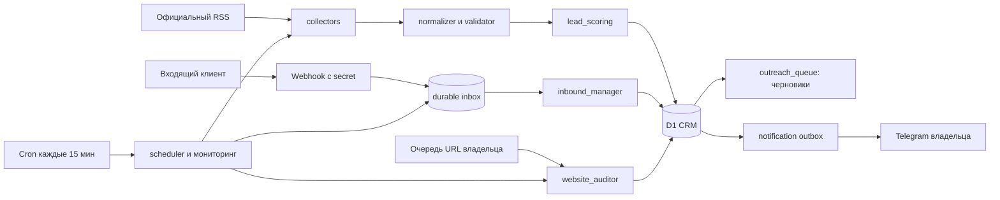

# Архитектура

Подготовленное обновление 09.10.2026: collector_dispatch выбирает RSS/FL/официальные Threads/VK; freshness требует исходную дату и бесплатность. FL ограничен 1 MiB, RSS 256 KiB. listCurrent и отправка outbox фильтруют устаревшее; archive явно отдельный. Threads public-search требует дополнительной верификации. Входящие поддерживают источник /start, бюджет, меню и отмену pending вопросов. Общий HTTP budget оставляет 10% Telegram. Публикация обновления ожидает billing guard.

TypeScript Cloudflare Worker, Cloudflare D1, официальный Telegram Bot API. GitHub Actions только CI, не постоянное хранилище и не production scheduler.

## Модули

`collectors`: официальный RSS/Atom, запрет DTD/ENTITY, объём 256 KiB, извлечение до 60 item/entry без полного XML дерева. `source_registry`: источник, политика, частота, бесплатность отклика. `normalizer`: HTML → текст, канонические ссылки, бюджеты и диапазоны. `validator`: свежесть, смысл задачи, исполнители/штат/учебные/закрытые/маркетинг. `deduplicator`: URL unique + SHA256 content unique. `lead_scoring`: A+/A/B, freshness, сроки, ТЗ, бюджет без порога. `message_builder`: правила, профиль исполнителя, никаких выдуманных кейсов/цен.

`storage`/`crm`: D1 leads и events; `crm` реализован методами Store, отдельный одноимённый файл не нужен. `telegram_bot`: whitelist, commands, card/buttons, outbox. `inbound_manager`: честный автоматический сценарий, 7 вопросов, suppression/удаление. `outreach_queue`: черновики, consent/policy/recipient gates; активных outbound adapters нет.

`business_discovery`: OpenStreetMap Overpass, до 10 карточек/небольшая область, website evidence без утверждения «сайта нет», без телефонов. `website_auditor`: DNS/public URL, robots, GET без redirects, viewport/title/description/empty image src/HTTP. `scheduler`: leased run, source backoff, quota, batched inserts, inbox recovery, daily/weekly reports, retention. `analytics`: агрегаты; `monitoring`: безопасные коды ошибок.

## Постоянное состояние

`leads`: payload с исходным текстом и всеми полями, плюс indexed source/category/status/score/date. `events`: изменения/ошибки. `source_state`: last check, next run, failures и counters. `settings`: pause/shutdown, last tick/cleanup. `leases`: исключение пересекающихся запусков. `quotas`: daily jobs. `inbox`: Telegram update ID unique. `outbox`: уникальный ключ уведомления, состояния pending/sending/sent/failed/unknown. `inbound_sessions`: текущий опрос. `suppression`: salted contact hash. `audit_jobs`: evidence и результат. `outreach_queue`: message/policy/consent; не транспорт сообщений.

## Отказы

Webhook сохраняет update прежде обработки; если D1 недоступен — безопасный 503, Telegram повторит запрос. GET retry bounded, источник backoff сохраняется в D1. `sendMessage` не повторяется при неопределённом сетевом результате: иначе невозможно гарантировать отсутствие дубля. Unknown delivery надо проверять вручную. Подтверждённый 429 переносится на retry_after. Истёкший lease позволяет следующему тику продолжить.

Сырые exception и response Telegram никогда не логируются. Найденные публикации не исполняются и не становятся инструкциями.

## Неполные функции

Полноценный браузерный аудит, формы/каталог/корзина, юридическое подтверждение бизнеса/отсутствия сайта, Thread/VK/биржевые аккаунты, личный Telegram-аккаунт и автоматические исходящие не подключены. Адаптеры должны иметь отдельную проверку технических прав, правил и согласий.
